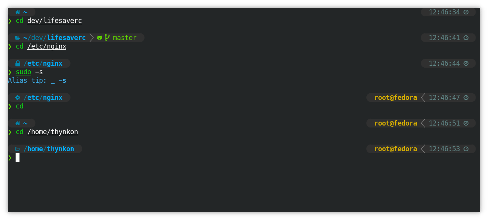

# dotfiles
The instructions below allow you to have the exact same setup as I do.

## Table of Contents

1. [ZSH](#ZSH)
   1. [Configuration framework](#configuration-framework)
   1. [Plug-ins](#plug-ins)
   1. [Screenshot](#screenshot)
1. [Setup](#setup)
   1. [Dotfiles manager](#dotfiles-manager)
   1. [Installation](#installation)

## ZSH
```shell
$ sudo pacman -S zsh
```
### Configuration framework
I use zprezto as my configuration framework. It setups some options by default
and makes my life easier :).

```shell
$ git clone --recursive https://github.com/sorin-ionescu/prezto.git "${XDG_DATA_HOME:-$HOME/.local/share}/zprezto"
```

#### Fonts
```shell
$ sudo pacman -S powerline-fonts
```

```shell
$ yay -S ttf-meslo-nerd-font-powerlevel10k
```

### Plug-ins
All zsh plugins are installed by [zplug](https://github.com/zplug/zplug), which
is a plugin manager. Since zprezto searches for modules under
ZPREZTO_HOME/contrib, I have set the 'ZPLUG_REPOS' variable to it so all
plugins will be installed and automatically loaded by zprezto.

```sh
$ mkdir -p "${XDG_DATA_HOME:-$HOME/.local/share}/zprezto/contrib"
```

```sh
$ ZPLUG_HOME="${XDG_DATA_HOME:-$HOME/.local/share}/zplug" curl -sL --proto-redir -all,https https://raw.githubusercontent.com/zplug/installer/master/installer.zsh | zsh
```

Reopen your terminal emulator and install zsh plugins:
```sh
$ zplug install
```
### Screenshot


## Setup
### Dotfiles manager
```sh
$ sudo pacman -S chezmoi
```

### Installation
You will be asked to enter your name, email and your type of computer (desktop or laptop).

With the informations you have entered, chezmoi will be able to setup your
`~/.config/git/config` file as well as other files according to your computer.
```sh
$ chezmoi init https://github.com/Thynkon/dotfiles.git
```
